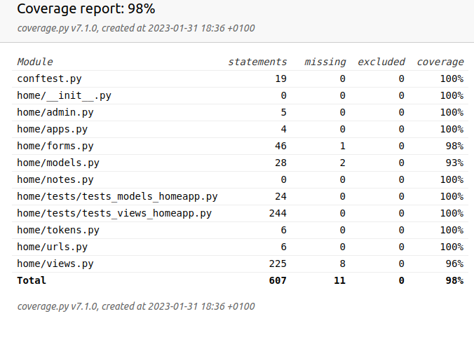

# ShareIt
A django webapp. Users can donate institutions. Supports charity.

## Main features:
1. User receives account confirmation email with generated token.
2. User can reset his password if it was forgotten.
3. User can supply donations to chosen institutions with supported categories. ( Form uses JS code )
4. User can edit his password and personal information, change have to be confirmed with correct old password.
5. User can see all of his donations, also archive them by selecting if it was taken.
6. Admin can add/modify other users and database models.

## Installation:
### Without Docker:
* Clone the repository 
```
$ git clone https://github.com/MarcinSerwinski/ShareIt.git
```
* Create virtual environment to install dependencies and activate it:
```
$ python -m venv venv
$ source venv/bin/activate
```
* Install the dependencies:
```
(venv)$ pip install -r requirements.txt
```
* Remember to fill up environmental variables pointed out in env/.env-default.txt. File
  path has to be env/.env ( same dir as .env-default.txt ).
* Superuser already created within initial migration.
```        
username='superuser@user.com',
email='superuser@user.com',
password='AdminStrongPass1!'
```
* Make migrations and apply them:
```
(venv)$ python manage.py makemigrations home
```
```
(venv)$ python manage.py migrate
```
* Fill up database through admin panel.
### Docker:
* Clone the repository 
```
$ git clone https://github.com/MarcinSerwinski/ShareIt.git
```
* Set up environmental variables in .env file located in project root.
  NOTE: DATABASE_URL var is working, project uses sqlite3 due to its lightweight.  
* Build up container:
```
docker-compose up --build
```
* Superuser already created within initial migration.
```        
username='superuser@user.com',
email='superuser@user.com',
password='AdminStrongPass1!'
```
* Fill up database through admin panel.

### ENJOY!

### TESTS COVERAGE:
